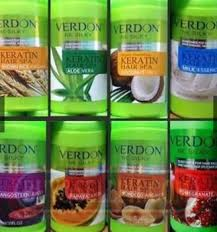
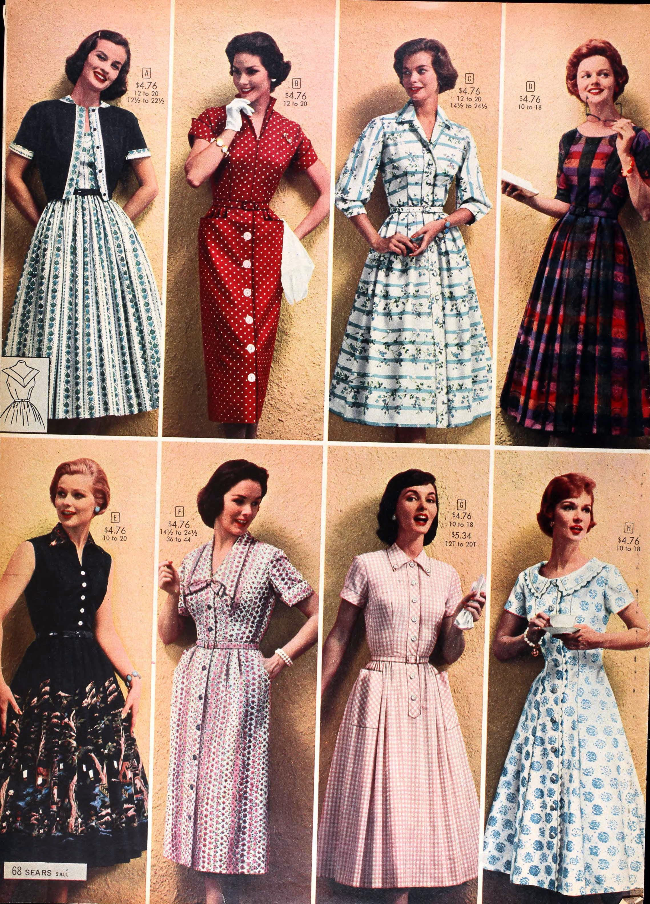
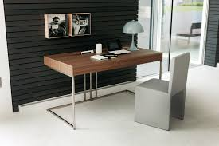

# Exercise-4
Exercise on table with content

<!DOCTYPE html>
<html>
    <head>
        
    </head>
    <table>
    
        <tr>
            <td class="border1";>  Hair Treatments</td>
            <td class="border1"> Internal Solid State Drives</td>
            <td class="border1"> Over-the-Ear Headphones</td>
            <td class="border1"> Hair Coloring</td>
            <td class="border1"> Mobiles</td>
            <td class="border1"> Men's Tshirts</td>
            <td class="border1"> Mobile Phone Cases</td>
            <td style="border-bottom: 5px solid #f1f0f0";> Other Bike Parts</td>
        </tr>
        <tr>
            <td class="border2"> In-ear Headphones</td>
            <td class="border2"> Phone Cables & Converters</td>
            <td class="border2">  Women's Dresses</td>
            <td class="border2">  Plant, Seeds and Bulbs</td>
            <td class="border2"> Health Accessories</td>
            <td class="border2"> Wall Stickers & Decals</td>
            <td class="border2"> Women's Tshirts</td>
            <td>  Home Office Desks</td>
        </tr>
        </table>
        </html>
